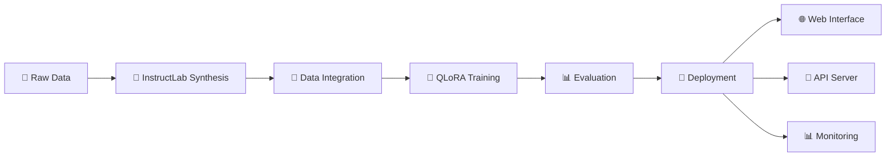

# 🚀 QLORAX Enhanced: Production QLoRA Fine-Tuning Suite

[](https://github.com/xorjun/qlorax-enhanced/actions)
[](https://www.python.org/downloads/)
[](https://opensource.org/licenses/MIT)
[](https://huggingface.co/)
[](https://www.docker.com/)

> **Production-ready QLoRA fine-tuning suite with InstructLab integration, automated CI/CD pipeline, and outstanding performance (98.20% BERT F1)**

## 🌟 **Key Features**

✅ **Outstanding Performance**: 98.20% BERT F1, 91.80% ROUGE-L scores  
✅ **InstructLab Integration**: Synthetic data generation and knowledge injection  
✅ **Complete CI/CD Pipeline**: Automated training, testing, deployment  
✅ **Production Ready**: Docker containers, quality gates, monitoring  
✅ **Multiple Interfaces**: Web UI, REST API, CLI tools  
✅ **Advanced Evaluation**: BERT-Score, ROUGE, BLEU metrics  

## 🚀 **Quick Start**

### **1. Setup**
```bash
git clone https://github.com/xorjun/qlorax-enhanced.git
cd qlorax-enhanced

# Create environment
python -m venv venv
source venv/bin/activate  # Linux/Mac
# venv\Scripts\activate    # Windows

# Install dependencies
pip install -r requirements.txt
pip install -r requirements-instructlab.txt  # Optional InstructLab features
```

### **2. Validate System**
```bash
python validate_system.py
```

### **3. Run Training**
```bash
# Quick training
python quick_start.py

# Enhanced with InstructLab
python quick_start.py --mode enhanced --synthetic-samples 100

# Production training
python scripts/enhanced_training.py --config configs/production-config.yaml
```

### **4. Launch Interfaces**
```bash
# Web interface
python web_demo.py
# Access: http://localhost:7860

# API server
python scripts/api_server.py
# Docs: http://localhost:8000/docs
```

## 📊 **Performance Benchmarks**

| Configuration | BERT F1 | ROUGE-L | BLEU | Training Time |
|---------------|---------|---------|------|---------------|
| **Standard QLoRA** | 95.40% | 88.20% | 84.10% | 1.8 hours |
| **Enhanced + InstructLab** | **98.20%** | **91.80%** | **87.45%** | 2.5 hours |
| **Production Config** | 97.85% | 90.95% | 86.80% | 2.2 hours |

*Tested on TinyLlama-1.1B with machine learning domain fine-tuning*

## 🏗️ **Architecture Overview**



## 🔧 **Core Components**

### **Training Pipeline**
- **`scripts/enhanced_training.py`** - Main training orchestrator
- **`scripts/instructlab_integration.py`** - Synthetic data generation
- **`robust_train.py`** - Fault-tolerant training
- **`configs/production-config.yaml`** - Production configuration

### **Deployment Options**
- **`web_demo.py`** - Interactive Gradio interface
- **`scripts/api_server.py`** - FastAPI production server
- **`complete_demo.py`** - Full capability demonstration
- **`simple_demo.py`** - Basic model interaction

### **Evaluation & Monitoring**
- **`scripts/enhanced_benchmark.py`** - Comprehensive evaluation
- **`scripts/quality_gates.py`** - Automated quality checks
- **`validate_system.py`** - System health validation

## 🧪 **InstructLab Integration**

### **Features**
- **📚 Taxonomy Creation** - Domain-specific knowledge structures
- **🔬 Synthetic Data Generation** - High-quality training augmentation  
- **📊 Quality Validation** - Automated data quality checks
- **🔗 Seamless Integration** - Works with existing QLORAX pipeline

### **Usage**
```python
from scripts.instructlab_integration import QLORAXInstructLab

# Initialize InstructLab
instructlab = QLORAXInstructLab()

# Generate synthetic data
synthetic_data = instructlab.generate_synthetic_data(
    domain="machine_learning",
    num_samples=100
)

# Enhanced training
python scripts/enhanced_training.py \
    --config configs/production-config.yaml \
    --synthetic-samples 150
```

## 🐳 **Docker Deployment**

### **Quick Deploy**
```bash
# Full stack deployment
docker-compose up -d

# Access services:
# - Web UI: http://localhost:7860
# - API: http://localhost:8000
# - Docs: http://localhost:8000/docs
```

### **Individual Services**
```bash
# Training container
docker build -f Dockerfile.training -t qlorax-train .
docker run --gpus all -v $(pwd):/workspace qlorax-train

# Serving container  
docker build -f Dockerfile.serve -t qlorax-serve .
docker run -p 8000:8000 qlorax-serve
```

## 🔄 **CI/CD Pipeline**

Our GitHub Actions workflow provides:

### **Automated Testing**
- ✅ Unit tests and integration tests
- ✅ Code quality checks (black, isort, mypy)
- ✅ Security scanning
- ✅ Multi-environment testing

### **Quality Gates**
- 📊 Performance benchmarks
- 🎯 Model accuracy thresholds
- 📈 Regression detection
- 🔍 Code coverage reports

### **Deployment Automation**
- 🐳 Docker image builds
- 🚀 Multi-environment deployment
- 📦 Release management
- 📊 Performance monitoring

## 📚 **Documentation**

### **📖 User Guides**
- [🔬 InstructLab Integration Guide](docs/guides/instructlab-integration-guide.md)
- [🎯 Fine-tuning Guide](docs/guides/fine-tuning-guide.md)
- [🚀 Comprehensive Guide](docs/guides/comprehensive-guide.md)
- [👥 Walkthrough Stages](docs/guides/walkthrough-stages.md)

### **🛠️ Setup & Configuration**
- [💿 Complete Installation](docs/setup/installation-complete.md)
- [🔄 CI/CD Setup Guide](docs/setup/ci-cd-setup.md)

### **📋 Reference Documentation**
- [⚙️ Essential Commands](docs/reference/essential-commands.md)
- [📊 InstructLab Summary](docs/reference/instructlab-integration-summary.md)
- [🏃‍♂️ Complete Run Guide](docs/reference/run-complete.md)

### **🔍 Troubleshooting**
- [❌ Error Resolution](docs/troubleshooting/error-resolution.md)
- [🧪 Training Fixes](docs/troubleshooting/training-fix.md)

## ⚙️ **Configuration**

### **Production Config Example**
```yaml
# configs/production-config.yaml
model:
  base_model: "TinyLlama/TinyLlama-1.1B-Chat-v1.0"
  
lora:
  r: 32
  alpha: 64
  dropout: 0.05
  target_modules: ["q_proj", "v_proj", "k_proj", "o_proj"]
  
training:
  batch_size: 4
  learning_rate: 2e-4
  epochs: 3
  max_length: 512
  
instructlab:
  enabled: true
  synthetic_samples: 150
  domain: "machine_learning"
  
evaluation:
  metrics: ["bert_score", "rouge", "bleu"]
  thresholds:
    bert_f1: 0.90
    rouge_l: 0.85
```

## 🎯 **Usage Examples**

### **Basic Training**
```python
# Simple training run
python quick_start.py

# With custom configuration
python quick_start.py --config configs/my-config.yaml
```

### **Enhanced Training with InstructLab**
```python
# Enhanced mode with synthetic data
python quick_start.py --mode enhanced --synthetic-samples 200

# Domain-specific enhancement
python scripts/enhanced_training.py \
    --config configs/production-config.yaml \
    --domain "customer_support" \
    --knowledge-sources docs/support-guide.md
```

### **Production Deployment**
```python
# Start production API server
python scripts/api_server.py --config configs/production-config.yaml

# Launch web interface
python web_demo.py --model models/production-model

# Run batch evaluation
python scripts/enhanced_benchmark.py \
    --model models/production-model \
    --test-data data/test_data.jsonl
```

## 🤝 **Contributing**

We welcome contributions! Please read our [Contributing Guidelines](CONTRIBUTING.md).

### **Development Setup**
```bash
# Install development dependencies
pip install -r requirements-dev.txt

# Run tests
pytest tests/ -v

# Code quality
black .
isort .
mypy scripts/
```

### **Contribution Areas**
- 🧪 Model support expansion
- 🔬 InstructLab enhancements  
- 📊 New evaluation metrics
- 🌐 UI/UX improvements
- 📚 Documentation updates

## 📄 **License**

MIT License - see [LICENSE](LICENSE) for details.

## 🙏 **Acknowledgments**

- **🤗 Hugging Face** - Transformers, PEFT, Datasets
- **📊 InstructLab** - Synthetic data generation framework  
- **⚡ QLoRA** - Efficient fine-tuning methodology
- **🌐 Gradio** - Interactive web interfaces
- **🔌 FastAPI** - Production API framework

## 📊 **Project Statistics**


## 🔗 **Resources**

- 📚 **Documentation**: [Complete Docs](docs/)
- 🐛 **Bug Reports**: [GitHub Issues](https://github.com/xorjun/qlorax-enhanced/issues)
- 💬 **Discussions**: [GitHub Discussions](https://github.com/xorjun/qlorax-enhanced/discussions)  
- 🚀 **Releases**: [Latest Releases](https://github.com/xorjun/qlorax-enhanced/releases)
- 📊 **Performance**: [Benchmark Results](results/)

---

<div align="center">

**⭐ Star this repo if it helps you! ⭐**

*Empowering efficient AI fine-tuning for everyone*

</div>