# 🔄 QLORAX Production Process Flow

This document contains Mermaid diagrams showing the complete QLORAX production pipeline process flow.

## 📋 Complete Production Pipeline

```mermaid
graph TD
    A[🚀 Start Production Run] --> B[📋 System Validation]
    B --> C{✅ System Ready?}
    C -->|No| D[🔧 Install Dependencies]
    D --> B
    C -->|Yes| E[🎯 Choose Production Mode]
    
    E --> F[🧪 InstructLab Enhanced Mode]
    E --> G[⚡ Standard Training Mode]
    E --> H[🌐 Demo/Interface Mode]
    
    %% InstructLab Enhanced Path
    F --> I[📚 Create/Load Taxonomy]
    I --> J[🔬 Generate Synthetic Data]
    J --> K[🔗 Combine Original + Synthetic Data]
    K --> L[🎯 Enhanced QLoRA Training]
    
    %% Standard Training Path
    G --> M[📁 Load Training Data]
    M --> N[🎯 Standard QLoRA Training]
    
    %% Training Convergence
    L --> O[💾 Save Trained Model]
    N --> O
    
    %% Production Deployment
    O --> P[🚀 Deploy Production Services]
    P --> Q[🌐 Launch Web Interface]
    P --> R[🔌 Start API Server]
    P --> S[📊 Run Benchmarks]
    
    %% Demo Mode Path
    H --> T[🎭 Launch Demo Interface]
    T --> U[💬 Interactive Chat]
    T --> V[📋 Model Information]
    T --> W[🧪 Capability Demo]
    
    %% Production Monitoring
    Q --> X[📈 Monitor Performance]
    R --> X
    S --> X
    X --> Y[📊 Generate Reports]
    
    %% Styling
    classDef startEnd fill:#e1f5fe,stroke:#01579b,stroke-width:3px
    classDef process fill:#f3e5f5,stroke:#4a148c,stroke-width:2px
    classDef decision fill:#fff3e0,stroke:#e65100,stroke-width:2px
    classDef instructlab fill:#e8f5e8,stroke:#2e7d32,stroke-width:2px
    classDef deployment fill:#fce4ec,stroke:#c2185b,stroke-width:2px
    
    class A,Y startEnd
    class B,D,M,O,T,U,V,W,X process
    class C,E decision
    class F,I,J,K,L instructlab
    class P,Q,R,S deployment
```



## 🔬 InstructLab Integration Workflow

```mermaid
graph LR
    A[📋 InstructLab Start] --> B[📚 Taxonomy Creation]
    B --> C[🧪 Synthetic Data Generation]
    C --> D[🔍 Data Validation]
    D --> E[🔗 Data Integration]
    E --> F[🎯 Enhanced Training]
    F --> G[📊 Enhanced Evaluation]
    G --> H[🚀 Production Deployment]
    
    %% Subprocess Details
    B --> B1[📝 Define Domain]
    B --> B2[🎯 Seed Examples]
    B --> B3[📋 Knowledge Areas]
    
    C --> C1[🤖 Mock Generation]
    C --> C2[🔬 Full InstructLab]
    C --> C3[📈 Batch Processing]
    
    E --> E1[⚖️ Weight Configuration]
    E --> E2[📊 Quality Control]
    E --> E3[💾 Combined Dataset]
    
    %% Styling
    classDef main fill:#e3f2fd,stroke:#1565c0,stroke-width:3px
    classDef sub fill:#f1f8e9,stroke:#388e3c,stroke-width:2px
    
    class A,B,C,D,E,F,G,H main
    class B1,B2,B3,C1,C2,C3,E1,E2,E3 sub
```



## 🎯 QLoRA Training Pipeline

```mermaid
graph TD
    A[📁 Input Data] --> B[🔄 Data Preprocessing]
    B --> C[📊 Tokenization]
    C --> D[🎯 Model Loading]
    D --> E[🔧 LoRA Configuration]
    E --> F[🚀 Training Loop]
    
    F --> G{📈 Epoch Complete?}
    G -->|No| H[⚡ Forward Pass]
    H --> I[📉 Loss Calculation]
    I --> J[🔄 Backward Pass]
    J --> K[🎯 LoRA Update]
    K --> F
    
    G -->|Yes| L{🎯 Converged?}
    L -->|No| F
    L -->|Yes| M[💾 Save Adapters]
    
    M --> N[🔍 Model Validation]
    N --> O[📊 Performance Metrics]
    O --> P[✅ Production Ready]
    
    %% Configuration Details
    E --> E1[📊 Rank: 32]
    E --> E2[🎯 Alpha: 64]
    E --> E3[💧 Dropout: 0.05]
    E --> E4[🎪 Target Modules]
    
    %% Styling
    classDef input fill:#e8f5e8,stroke:#2e7d32,stroke-width:2px
    classDef process fill:#fff3e0,stroke:#f57c00,stroke-width:2px
    classDef decision fill:#fce4ec,stroke:#c2185b,stroke-width:2px
    classDef output fill:#e3f2fd,stroke:#1565c0,stroke-width:2px
    classDef config fill:#f3e5f5,stroke:#7b1fa2,stroke-width:2px
    
    class A input
    class B,C,D,F,H,I,J,K,N process
    class G,L decision
    class M,O,P output
    class E1,E2,E3,E4 config
```



## 🌐 Production Deployment Architecture

```mermaid
graph TB
    A[🚀 QLORAX Production] --> B[🧠 Trained Models]
    B --> C[📦 Model Registry]
    
    C --> D[🌐 Web Interface]
    C --> E[🔌 API Server]
    C --> F[📊 Batch Processing]
    
    D --> D1[🎨 Gradio Frontend]
    D --> D2[💬 Interactive Chat]
    D --> D3[📋 Model Info]
    
    E --> E1[⚡ FastAPI Server]
    E --> E2[🔗 REST Endpoints]
    E --> E3[📝 OpenAPI Docs]
    
    F --> F1[📊 Batch Inference]
    F --> F2[🧪 Evaluation Suite]
    F --> F3[📈 Performance Reports]
    
    %% Infrastructure
    G[🐳 Docker Containers] --> D
    G --> E
    G --> F
    
    H[☁️ Cloud Platform] --> G
    I[📈 Monitoring] --> D
    I --> E
    I --> F
    
    %% CI/CD Pipeline
    J[🔄 CI/CD Pipeline] --> K[🧪 Testing]
    K --> L[🚀 Deployment]
    L --> C
    
    %% Styling
    classDef core fill:#e1f5fe,stroke:#01579b,stroke-width:3px
    classDef interface fill:#f3e5f5,stroke:#7b1fa2,stroke-width:2px
    classDef infrastructure fill:#e8f5e8,stroke:#2e7d32,stroke-width:2px
    classDef cicd fill:#fff3e0,stroke:#f57c00,stroke-width:2px
    
    class A,B,C core
    class D,D1,D2,D3,E,E1,E2,E3,F,F1,F2,F3 interface
    class G,H,I infrastructure
    class J,K,L cicd
```



## 📊 Data Flow Architecture


## 🔄 CI/CD Pipeline Flow

```mermaid
gitgraph
    commit id: "Initial Setup"
    
    branch feature/instructlab
    commit id: "Add InstructLab Integration"
    commit id: "Synthetic Data Generation"
    commit id: "Enhanced Training Pipeline"
    
    checkout main
    merge feature/instructlab
    commit id: "Release v2.0"
    
    branch hotfix/performance
    commit id: "Optimize Memory Usage"
    commit id: "Fix Training Issues"
    
    checkout main
    merge hotfix/performance
    commit id: "Release v2.1"
    
    branch feature/production
    commit id: "Add Production Config"
    commit id: "Docker Containerization"
    commit id: "CI/CD Automation"
    commit id: "Quality Gates"
    
    checkout main
    merge feature/production
    commit id: "Production Release v3.0"
```

## 🎭 User Interaction Flows


## 📈 Performance Monitoring Dashboard

```mermaid
graph TD
    A[📊 Performance Dashboard] --> B[⚡ Real-time Metrics]
    A --> C[📈 Historical Trends]
    A --> D[🚨 Alert System]
    
    B --> B1[🔄 Request Rate]
    B --> B2[⏱️ Response Time]
    B --> B3[💾 Memory Usage]
    B --> B4[🎯 Model Accuracy]
    
    C --> C1[📅 Daily Stats]
    C --> C2[📊 Weekly Reports]
    C --> C3[📈 Monthly Trends]
    
    D --> D1[🚨 Performance Alerts]
    D --> D2[📧 Email Notifications]
    D --> D3[📱 Slack Integration]
    
    %% Data Sources
    E[🌐 Web Interface] --> B
    F[🔌 API Server] --> B
    G[📊 Batch Jobs] --> B
    
    %% Storage
    B --> H[💾 Time Series DB]
    C --> H
    H --> I[📊 Analytics Engine]
    I --> J[📝 Reports Generator]
    
    %% Styling
    classDef dashboard fill:#e3f2fd,stroke:#1565c0,stroke-width:3px
    classDef metrics fill:#f3e5f5,stroke:#7b1fa2,stroke-width:2px
    classDef alerts fill:#ffebee,stroke:#d32f2f,stroke-width:2px
    classDef storage fill:#e8f5e8,stroke:#2e7d32,stroke-width:2px
    
    class A dashboard
    class B,B1,B2,B3,B4,C,C1,C2,C3 metrics
    class D,D1,D2,D3 alerts
    class E,F,G,H,I,J storage
```



---

## 🎯 Usage Instructions

To use these diagrams:

1. **Copy the Mermaid code** from any section above
2. **Paste into any Mermaid-compatible tool**:
   - GitHub (supports Mermaid in markdown)
   - Mermaid Live Editor (mermaid.live)
   - VS Code with Mermaid extension
   - Confluence, Notion, or other documentation tools

3. **Customize as needed** for your specific deployment

## 📚 Legend

- 🚀 **Start/End Points** - Entry and exit points in the process
- 🔄 **Process Steps** - Active processing or transformation
- 💎 **Decision Points** - Conditional branching in the flow
- 💾 **Data Storage** - Persistent data or model storage
- 🌐 **User Interfaces** - Interactive components
- 📊 **Monitoring** - Performance and analytics tracking
- 🧪 **InstructLab** - Synthetic data generation processes
- 🎯 **QLoRA Training** - Core fine-tuning pipeline

---

*Generated for QLORAX Enhanced Production Pipeline - Complete Process Documentation*